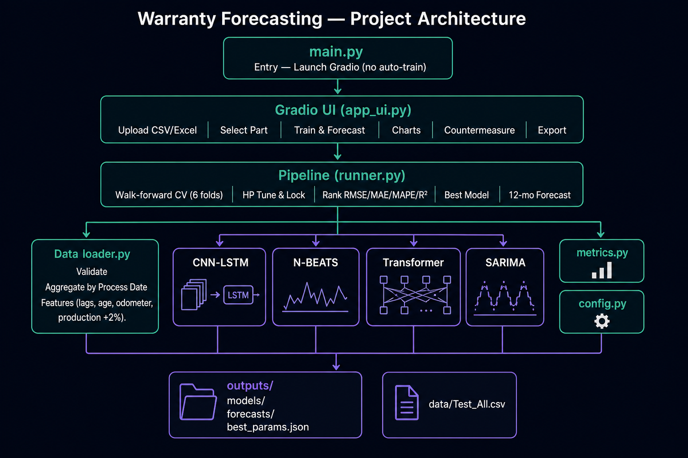
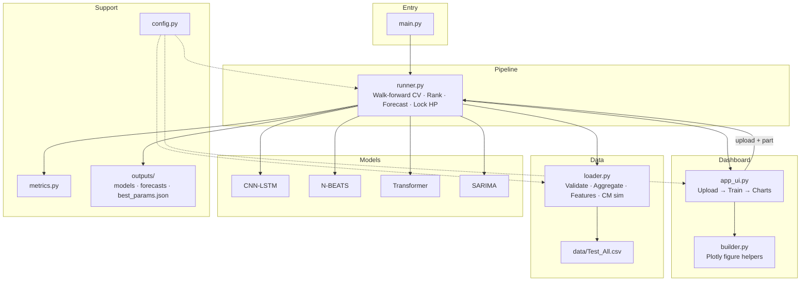

# Automotive Warranty Claims Forecasting — Project Architecture

This document describes the modular architecture of the warranty forecasting application.



---

## Overview

The system is an **upload-first Gradio application**:

1. `python main.py` opens the UI immediately (**no training** at startup).
2. User uploads CSV/Excel claims data and selects a **Part Name**.
3. Training runs only for that part (walk-forward CV → ranking → 12-month forecast).
4. Best hyperparameters are **locked** for reuse on later runs.

**Active models:** CNN-LSTM · N-BEATS · Transformer · SARIMA (baseline)  
**Not used:** XGBoost · LightGBM · Gradient Boosting

---

## Architecture Diagram (flow)



---

## Folder Structure

```
Forecastingv2cursor/
├── main.py                          # Entry point — launches Gradio only
├── requirements.txt
├── README.md
├── ARCHITECTURE.md                  # This file
├── architecture_diagram.png         # Architecture chart image
├── data/
│   ├── Test_All.csv                 # Combined claims dataset
│   ├── Test_All_Combined.csv        # Combined + source file column
│   └── Test 1–5.csv                 # Original split files (optional)
├── outputs/
│   ├── models/                      # Pickled trained model bundles
│   ├── forecasts/                   # Forecast / metrics CSV + JSON
│   └── best_params.json             # Locked hyperparameters per part
└── forecasting/                     # Main Python package
    ├── config.py                    # Constants, paths, seeds, model list
    ├── metrics.py                   # RMSE / MAE / MAPE / R² + ranking
    ├── data/
    │   └── loader.py                # Load, validate, feature engineer, CM
    ├── models/
    │   ├── base.py                  # Activations + Adam optimizer
    │   ├── cnn_lstm.py              # CNN-LSTM forecaster
    │   ├── nbeats.py                # N-BEATS forecaster
    │   ├── transformer.py           # Transformer forecaster
    │   └── ml_models.py             # SARIMA + HP grids (no tree ML)
    ├── pipeline/
    │   └── runner.py                # CV, train, forecast, persistence
    └── dashboard/
        ├── app_ui.py                # Interactive Gradio UI (upload-first)
        └── builder.py               # Plotly charts + CSS helpers
```

---

## Layer Responsibilities

| Layer | Path | Responsibility |
|---|---|---|
| **Entry** | `main.py` | CLI args; start Gradio; no auto-train |
| **Config** | `forecasting/config.py` | Horizon, lookback, CV folds, seed, paths, active models |
| **Data** | `forecasting/data/loader.py` | CSV/Excel load, validation, monthly aggregation by Process Date, features (lags, vehicle age, odometer stats, synthetic production +2%/mo), FCO/K countermeasure simulation |
| **Models** | `forecasting/models/` | CNN-LSTM, N-BEATS, Transformer (NumPy DL), SARIMA baseline |
| **Metrics** | `forecasting/metrics.py` | Walk-forward RMSE / MAE / MAPE / R²; ranking; best-model selection |
| **Pipeline** | `forecasting/pipeline/runner.py` | Walk-forward (last 6 months), HP tune or reuse locked params, refit, 12-month forecast, save artifacts |
| **UI** | `dashboard/app_ui.py` + `builder.py` | Upload, train button, diagnostics, countermeasure panel, export |
| **Outputs** | `outputs/` | Models, forecasts, locked `best_params.json` |

---

## Runtime Flow

```
python main.py
      │
      ▼
 Gradio opens (http://localhost:7860)
      │
      ▼
 User uploads CSV/Excel  ──►  loader.validate + prepare
      │
      ▼
 User selects Part Name
      │
      ▼
 Train & Forecast
      │
      ├─► Walk-forward CV (6 folds, leak-free scalers)
      ├─► HP tune (optional) OR reuse locked params
      ├─► Score CNN-LSTM / N-BEATS / Transformer / SARIMA
      ├─► Auto-select best model (RMSE/MAE/MAPE/R²)
      ├─► Refit on full history → 12-month forecast
      └─► Lock best params → outputs/best_params.json
      │
      ▼
 UI tabs: Results · Diagnostics · Countermeasure · Export
```

---

## Design Principles

- **Upload-first** — bundled data is not auto-trained on startup.
- **Part-scoped training** — only the selected part is trained.
- **Leak-free validation** — MinMaxScaler fit on each fold’s training slice only.
- **Locked hyperparameters** — first run can tune; later runs reuse `outputs/best_params.json`.
- **Separation of concerns** — figures in `builder.py`, UI wiring in `app_ui.py`, training only in `runner.py`.
- **Reproducibility** — fixed `RANDOM_SEED = 42` in config.

---

## Key Business Logic

| Topic | Implementation |
|---|---|
| Claim aggregation | By **Process Date** (claim month) |
| Manufacturing signal | **FCO/K Month** → vehicle age, batch features |
| Warranty lifecycle | 36 months (3 years) |
| Production feature | Synthetic: start 25,000, **+2% per month** |
| Lag features | Claim_Lag_1, 2, 3, 12 |
| Countermeasure | Reduce future claims share from selected FCO/K months |

---

## How to Run

```powershell
cd d:\Forecastingv2cursor
.\venv\Scripts\Activate.ps1
python main.py
```

Then in the UI: **Upload → Load & Validate → Select Part → Train & Forecast**.
