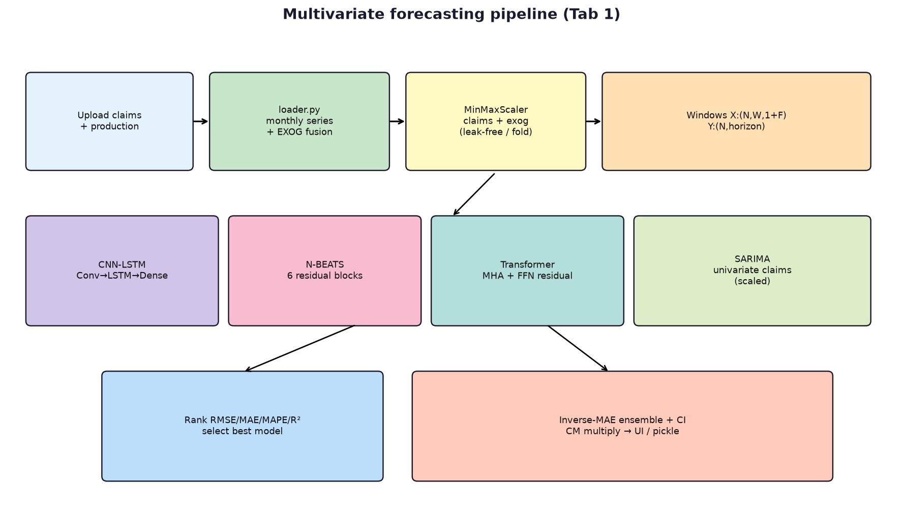
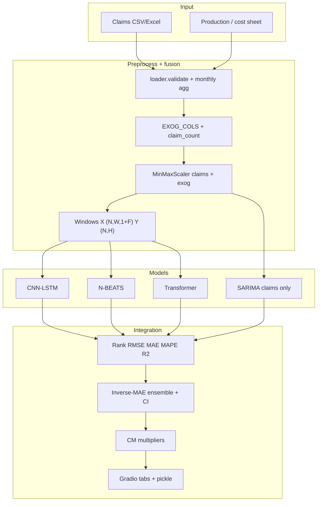
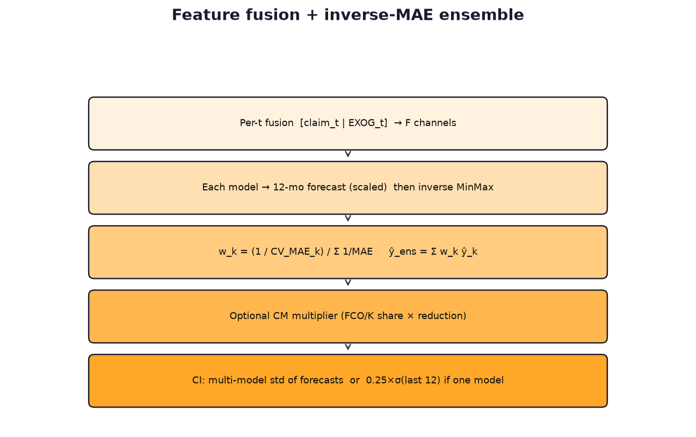
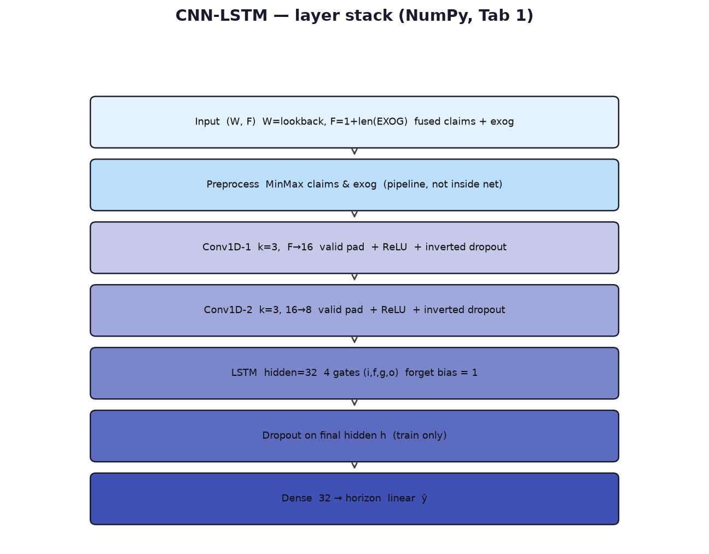
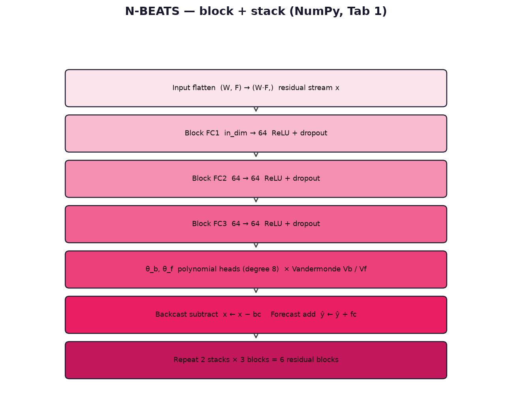
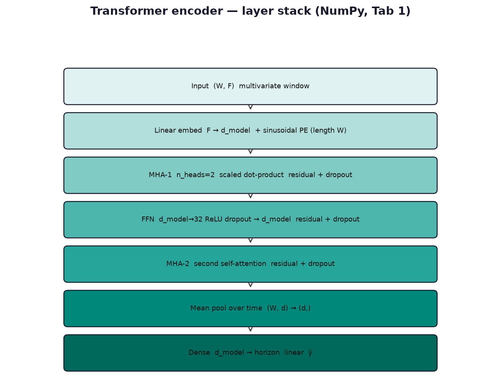
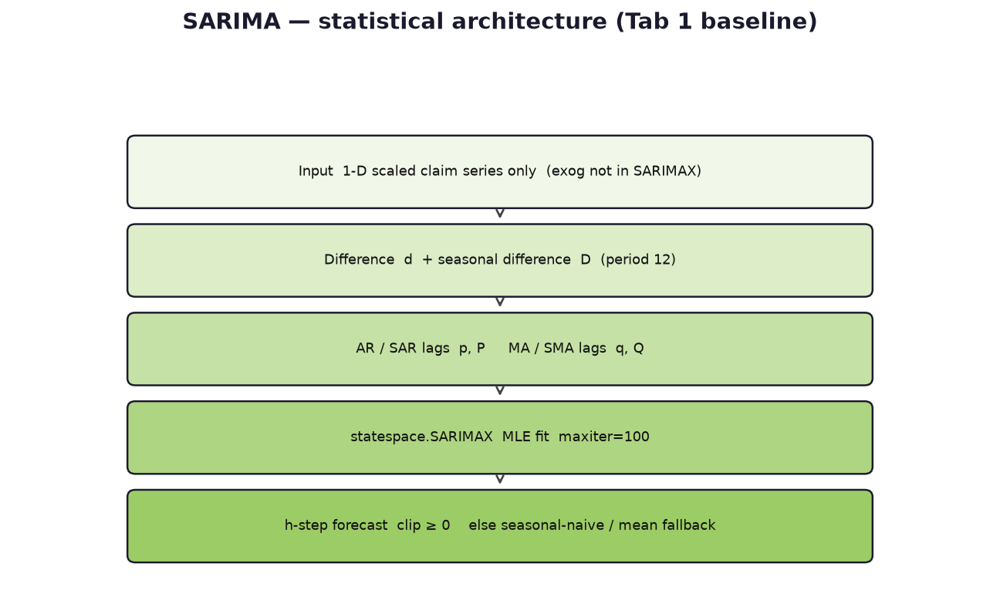
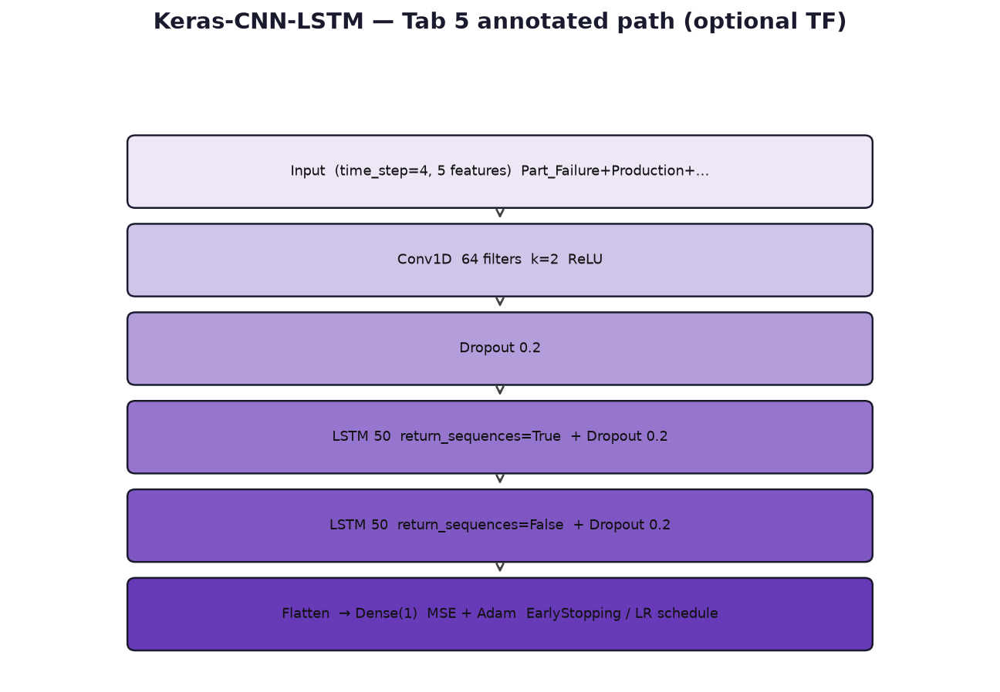

# Multivariate Forecasting Models — Complete Architecture

Automotive Warranty Claims Forecasting System. This document is aligned with the **implementation**, not a generic textbook stack.

**Primary sources:** `forecasting/models/*.py`, `forecasting/pipeline/runner.py`, `forecasting/data/loader.py`, `forecasting/metrics.py`, `forecasting/dashboard/app_ui.py`, `forecasting/config.py`.

Companion Word export: [`MULTIVARIATE_MODEL_ARCHITECTURE.docx`](MULTIVARIATE_MODEL_ARCHITECTURE.docx)  
**Univariate (Tab 3) architecture:** [`UNIVARIATE_MODEL_ARCHITECTURE.md`](UNIVARIATE_MODEL_ARCHITECTURE.md) · [`UNIVARIATE_MODEL_ARCHITECTURE.docx`](UNIVARIATE_MODEL_ARCHITECTURE.docx)  
Diagrams: [`docs/diagrams/`](diagrams/).

---

## 1. Scope and model roster

**Multivariate** in this project means Tab **1. Upload & Forecast**: claim counts are forecast from a lookback window that **concatenates** the target with exogenous drivers (production, odometer, vehicle age, FCO/K batch intensity, Fourier seasonality, calendar, lags).

| Model | Implementation | Purpose | Primary code |
|---|---|---|---|
| **CNN-LSTM** | Pure NumPy | Local motifs (1-D CNN) + temporal memory (LSTM) | `models/cnn_lstm.py` |
| **N-BEATS** | Pure NumPy | Residual polynomial basis expansion | `models/nbeats.py` |
| **Transformer** | Pure NumPy | Long-range dependence via self-attention | `models/transformer.py` |
| **SARIMA** | statsmodels | Seasonal classical **baseline** (claims series only) | `models/ml_models.py` |
| **Ensemble** | Pipeline logic | Inverse-MAE blend of the selected set | `pipeline/runner.py` |
| **Keras-CNN-LSTM** | TensorFlow (optional) | Annotated last-6-month test only | `pipeline/annotated_forecast.py` |

**Not used:** XGBoost, LightGBM, Gradient Boosting (`MODEL_NAMES` in `forecasting/config.py`).

Tab **3. Univariate Analysis** reuses the same NumPy classes with a **different** feature set (`UNI_FEATURE_COLS`). Those scores are **not** multivariate Tab 1 rankings. Full Tab 3 architecture: [`UNIVARIATE_MODEL_ARCHITECTURE.md`](UNIVARIATE_MODEL_ARCHITECTURE.md).

---

## 2. Shared data flow and integration points





### 2.1 Input layer (data)

- Canonical claims fields: `Part Name`, `FCOK_DATE`, `PROCESSING_DATE`, `ODOMETER`.
- Aggregation **by process month** (`PROC_MONTH`), calendar **reindexed** (no gaps); missing months get `claim_count = 0` and interpolated covariates.
- **Production is user-supplied** for training. Synthetic production is **disabled** when `require_production=True`.
- Optional `Production_Cost` enables CPV (`cost / production`).

### 2.2 Preprocessing, embedding, feature fusion

Exogenous channels (`EXOG_COLS` in `loader.py`):

```
avg_odometer, avg_vehicle_age, avg_mfctr_age, production,
sin_12, cos_12, sin_6, cos_6,
median_odometer, max_odometer, median_vehicle_age,
n_fcok_batches, warranty_share, Vehicle_Age,
Month, Year, Quarter,
Claim_Lag_1, Claim_Lag_2, Claim_Lag_3, Claim_Lag_12
```

Lags of claims that are missing at the start of the series are filled with the **mean claim count**. Fourier terms use time index `t = 0..T-1`.

**Window fusion** (`runner.build_window_dataset`):

```text
for i in range(N):
    win_y  = claims[i : i+W]          # shape (W, 1)
    win_ex = exog[i : i+W]            # shape (W, F_exog)
    X[i]   = concat(win_y, win_ex)    # shape (W, 1+F_exog)
    y[i]   = claims[i+W : i+W+H]      # shape (H,)
```

- Walk-forward CV: **H = 1** (next month).
- Full refit: **H = 12** (`FORECAST_HORIZON`).
- Lookback **W** = `min(12, T − horizon − n_folds − 2)` (must stay ≥ 4).

### 2.3 Normalization

- Separate `MinMaxScaler` for claims and for the exogenous matrix.
- **Each CV fold** fits scalers on `[:train_end]` only (no leakage).
- Inverse: clip scaled values to **[0, 1]**, invert, clip claims to **≥ 0**.
- After CV, scalers are **refit on full history** for the 12-month forecast.

### 2.4 Shared DL utilities (`models/base.py`)

| Feature | Behaviour |
|---|---|
| ReLU / sigmoid / tanh | Sigmoid and tanh are clipped for stability |
| Adam | Per-tensor keys; β1=0.9, β2=0.999 |
| Inverted dropout | Train only; scale `1/(1−p)`; default **p = 0.2** |
| Early stopping | Patience **5**, restore best weights |
| Seed | `RANDOM_SEED = 42` |



### 2.5 Ranking, ensemble, CI, countermeasure

Composite rank weights (`METRIC_RANK_WEIGHTS`): RMSE 0.30, MAE 0.25, MAPE 0.25, R² 0.20 (R² inverted to a cost). MAPE ignores near-zero actuals.

```text
w_k     = (1 / (CV_MAE_k + 1e-9)) / Σ_j (1 / (CV_MAE_j + 1e-9))
y_ens   = inverse_minmax( Σ_k w_k · y_k_scaled )  ×  cm_mults
```

- One selected model → that model is the forecast; ensemble weight = 1.
- **CI (multi-model):** `best ± 1.5 × std(model forecasts)`.
- **CI (single model):** `best ± 1.5 × max(0.25·std(last 12 claims), 1)`.
- Config CM (`apply_countermeasure`) and UI CM (peak FCO/K / Tab 4 simulator) **multiply** forecasts after the models run.

### 2.6 Persistence

`outputs/models/` (pickle: scalers, DL objects, weights), `outputs/forecasts/`, `outputs/best_params.json`. **CNN-LSTM is never grid-searched** (`lr=1e-2`, `epochs=40`).

---

## 3. CNN-LSTM

**Purpose:** Detect short local patterns in the fused window with stacked 1-D convolutions, then summarise the shortened sequence with an LSTM and map the last hidden state to a multi-step claim forecast.



### 3.1 Layer-by-layer

| Stage | Description | Shapes / parameters |
|---|---|---|
| **Input** | One fused window | `(W, F)`, F ≈ 1 + 21 exog |
| **Preprocess** | Leak-free MinMax in `runner` (not inside the class) | — |
| **Conv1** | Valid 1-D conv, kernel **3**, **16** filters, ReLU | `(W,F) → (W−2, 16)`; `Wc1 (3,F,16)` |
| **Dropout** | Inverted, rate 0.2, train only | same |
| **Conv2** | Valid 1-D conv, kernel **3**, **8** filters, ReLU | `(W−2,16) → (W−4, 8)` |
| **Dropout** | Inverted 0.2 | same |
| **LSTM** | 4 gates; last hidden only | `h,c ∈ ℝ³²`; `Wlstm (40, 128)` |
| **Dropout** | On `h` | `ℝ³²` |
| **Output** | Dense linear | `Wd (32, H)` |

LSTM step:

```text
[i, f, g, o] = split( concat(x_t, h) @ Wlstm + blstm , 4 )
c = σ(f) ⊙ c + σ(i) ⊙ tanh(g)     # forget bias init = 1
h = σ(o) ⊙ tanh(c)
```

Valid conv **shortens** time: W=12 → 10 → **8** steps into the LSTM. There is **no attention**.

### 3.2 Additional features unique to CNN-LSTM

- Forget-gate bias **+1** (standard LSTM trick).
- **Analytic** MSE grads on Dense; **sparse numerical** grads (128 random entries) on LSTM weights only.
- **Convolution kernels are not trained** after random init (fixed feature extractor).
- No hyperparameter grid (CPU/NumPy cost).
- Dropout disabled at `predict()`.

### 3.3 Pseudo-architecture

```text
x: (W, F)
c1 = Dropout(ReLU(Conv1D_k3(x, filters=16)))
c2 = Dropout(ReLU(Conv1D_k3(c1, filters=8)))
h  = LSTM_32(c2)[-1]
y  = Dense(H)(Dropout(h))          # linear
```

### 3.4 Pipeline and UI

Factory `_make_dl_model("CNN-LSTM")`. CV uses H=1; refit uses H=12 on the last window. Surfaces: Tab 1 ranking/forecast/AVP/HP table; Tab 2 comparison + CV folds; Tab 5 NumPy CNN-LSTM; Tab 6 CSV/PPT.

---

## 4. N-BEATS

**Purpose:** Interpretable **basis expansion** with **doubly residual** stacks. Multivariate windows are **flattened** so every exogenous channel is visible to the first fully connected layer.



### 4.1 Layer-by-layer (one block, then stack)

| Stage | Description | Shapes / parameters |
|---|---|---|
| **Input** | Flatten `(W, F)` | `in_dim = W · F` |
| **FC1–FC3** | Width **64**, ReLU, dropout 0.2 | `W1 (in,64)`, `W2/W3 (64,64)` |
| **θ heads** | Linear to **theta_dim = 8** | `Wtb`, `Wtf (64, 8)` |
| **Basis** | Vandermonde on `t∈[-1,0]` (backcast) and `[0,1]` (forecast) | `bc = θ_b V_bᵀ`, `fc = θ_f V_fᵀ` |
| **Residual** | `x ← x − bc`; `ŷ ← ŷ + fc` | **2 stacks × 3 blocks = 6** |
| **Output** | Sum of block forecasts | `(H,)` |

No convolution, recurrence, or attention. “Embedding” is the flatten + first FC.

### 4.2 Additional features unique to N-BEATS

- Doubly residual topology (backcast cleans `x`; forecasts **accumulate** — block-level fusion).
- **Polynomial** basis (degree 0…7), not Fourier (Fourier lives in EXOG instead).
- Training updates **only** `Wtf` / `btf` (sparse numerical, 40 entries). Other block weights stay at init.
- HP grid when tuning: `lr ∈ {5e-3, 1e-3}`, `epochs ∈ {50, 80}`.

### 4.3 Pseudo-architecture

```text
x = flatten(window)      # residual stream
y = 0
for block in 6_blocks:
    h  = FC_stack_3x64(x)          # ReLU + dropout
    bc = (h @ Wtb + btb) @ Vb.T
    fc = (h @ Wtf + btf) @ Vf.T
    x  = x - bc
    y  = y + fc
return y
```

### 4.4 Pipeline and UI

Same fused windows as CNN-LSTM. Colour `#FF6584`. Tab 3 univariate uses the same class with **claims-only** features — do not mix metrics with Tab 1.

---

## 5. Transformer

**Purpose:** Let every lookback month attend to every other month (**encoder** self-attention), then **mean-pool** and map to the horizon. There is **no decoder** and **no causal mask**.



### 5.1 Layer-by-layer

| Stage | Description | Shapes / parameters |
|---|---|---|
| **Input** | Fused window | `(W, F)` |
| **Embedding** | Linear `F → d_model` + **sinusoidal PE** | `We (F,d)`; `PE (W,d)`; default **d=16** |
| **MHA-1** | Scaled dot-product, **n_heads=2** | `dh = d/2`; `Wq,Wk,Wv`; `Wo` |
| **Residual + dropout** | `e ← e + Drop(Attn(e))` | `(W, d)` |
| **FFN** | `d → 32` ReLU dropout → `d`, residual + dropout | `Wff1 (d,32)`, `Wff2 (32,d)` |
| **MHA-2** | Second attention residual (**no second FFN**) | `(W, d)` |
| **Pool + Dense** | Mean over time; linear to H | `Wd (d, H)` |

Softmax subtracts the row max. Full `W×W` attention (not causal).

### 5.2 Additional features unique to Transformer

- Only explicit **time encoding** inside the net is PE (base 10000).
- Residuals wrap attention and FFN (add, not pre-norm).
- HP grid: `d_model ∈ {16,32}`, `lr ∈ {3e-3,1e-3}`, `epochs ∈ {40,70}`; **heads fixed at 2** in `_make_dl_model`.
- Analytic Dense grads use `mean(xWe + be + PE)` — **approximation** (ignores attention/FFN for `Wd`).
- Sparse numerical grads on **`Wo`, `Wff2`, `We` only**. **`Wq/Wk/Wv` are not trained**.
- `d_model` must be divisible by `n_heads`.

### 5.3 Pseudo-architecture

```text
e = x @ We + be + PE
e = e + Dropout(MHA(e))
e = e + Dropout(Linear(Dropout(ReLU(e @ Wff1))))
e = e + Dropout(MHA(e))
y = mean(e, axis=time) @ Wd + bd
```

### 5.4 Pipeline and UI

`PE` length equals lookback at **construction**. Short series change `W`, so a new `TransformerForecaster` is built per part. Same tabs as other DL models.

---

## 6. SARIMA (pipeline baseline)

**Purpose:** Seasonal-difference baseline on **scaled claim counts**. Exogenous channels are **not** passed into `SARIMAX`; SARIMA still **ranks and ensembles** with the DL models.



### 6.1 Layer-by-layer (statistical)

| Stage | Description | Notes |
|---|---|---|
| **Input** | 1-D scaled `claim_count` | Same MinMax as DL **target** |
| **Difference** | `d` and seasonal `D`, period 12 | `enforce_stationarity/invertibility=False` |
| **AR / MA** | `(p,d,q)` | Grid: `(1,1,1)`, `(1,1,0)`, `(0,1,1)` |
| **Seasonal** | `(P,D,Q,12)` | `(1,1,0,12)` or `(0,1,1,12)` |
| **Output** | `forecast(H)`, clip ≥ 0 | H=1 CV; H=12 refit |

No dropout, residual FC, convolution, or attention.

### 6.2 Additional features unique to SARIMA

- Fit failure → **seasonal naive** (last 12 cycle) or **mean**.
- `grid_search_sarima`: lowest 1-step MAE on fold-1 next month.
- JSON lock restores **tuples** via `_restore_param_types`.

### 6.3 Pseudo-architecture

```text
try:
    m = SARIMAX(y, order=(p,d,q), seasonal_order=(P,D,Q,12))
    return clip(m.fit(maxiter=100).forecast(H), min=0)
except:
    return seasonal_naive_last12(y) or mean(y)
```

---

## 7. Inverse-MAE ensemble

**Purpose:** Fuse selected model forecasts into one path and quantify disagreement.

```text
w_k = (1 / (MAE_k + 1e-9)) / sum_j (1 / (MAE_j + 1e-9))
y_ens_scaled = sum_k w_k * y_k_scaled
y_ens = inverse_minmax(y_ens_scaled) * cm_mults
```

Stored as `result["ensemble_raw"]`, `result["weights"]`, pickle `trained_bundle["weights"]`. Overlay + table on Tab 1; PPT on Tab 6.

---

## 8. Keras-CNN-LSTM (Tab 5 only)

**Purpose:** Optional TF path for **annotated** last-6-month evaluation with a **smaller** feature set. **Not** used for Tab 1’s 12-month production forecast. Hidden if TensorFlow is missing.



| Stage | Detail |
|---|---|
| **Input features** | `Part_Failure`, `Production`, `Warranty_Days`, `Countermeasure`, `FCOK_Jan_Aug` |
| **Window** | `time_step=4`; target = next `Part_Failure` |
| **Conv1D** | 64 filters, kernel **2**, ReLU |
| **Dropout** | 0.2 |
| **LSTM** | 50 units, `return_sequences=True` + dropout |
| **LSTM** | 50 units, last state + dropout |
| **Flatten → Dense(1)** | MSE, Adam; EarlyStopping + LR scheduler |
| **Inverse scale** | Pad extra feature channels with 0 |

---

## 9. Tab-wise UI outputs

Actual Gradio tabs (`app_ui.py`):

| Tab | Name | Multivariate meaning | How to read |
|---|---|---|---|
| **1** | Upload & Forecast | Upload, part, **model multi-select**, production/cost, CM, status (best model), history+forecast, 12-mo table, actual vs predicted, **ranking**, **HP**, CPV / claim-ratio history | Green load = schema OK. Ranking is leak-free OOS. Forecast is best (or only) model after CM. Every month needs **positive production** to train. |
| **2** | Diagnostics | Production, vehicle age, odometer, **FCO/K × process heatmap**, rolling **CV** MAE, **model comparison** | Heatmap = manufacturing months driving claim months. CV = stability. Comparison matches Tab 1 metrics. |
| **3** | Univariate Analysis | Claims-only Holt-Winters / SARIMA / CNN-LSTM / Transformer / N-BEATS — see univariate architecture doc | **Do not** treat as multivariate scores. |
| **4** | Reduction | FCO/K picker, reduction %, original vs adjusted, monthly & cumulative reduction, share, CSV | What-if on selected batches over **36** warranty months. Needs a Tab 1 train. |
| **5** | Annotated Walk-Forward | Last 6 months actual vs forecast; Error / Error% / Accuracy%; Keras optional; CSV | Stress-test feeding. Accuracy% = `1 − \|e\|/actual` when actual ≠ 0. Slow if many models. |
| **6** | Summary & Export | KPIs, summary table, ranking, CSV, **PPTX** | PPT: ranking, economics, CM; univariate slides if Tab 3 was run. Chart images need `kaleido`. |

### 9.1 Tab 1 widgets → models

- **Models for forecasting** → `selected_models` → `_resolve_selected_models`.
- **Tune hyperparameters** → grid on fold-1 (except CNN-LSTM) **or** `best_params.json`.
- **12-Month Forecast** → `best_forecast` + ensemble/CI if multiple models.
- **Actual vs Predicted** → `oos_actual` vs `oos_preds[model]`.
- **Hyperparameters Used** → SARIMA orders + DL `lr` / `epochs` / `d_model`.

---

## 10. Edge-case testing notes

| Case | Expected behaviour | Where to verify |
|---|---|---|
| Empty / unknown part | No monthly rows; train skipped | Tab 1 status |
| Zero total claims | `run_pipeline_for_part` returns `None` (`SKIP`) | Log / status |
| Series too short (`W < 4`) | SKIP — cannot fit lookback + 6 folds + horizon | Tab 1 |
| Missing / non-positive production | `ValueError`; synthetic production off | Tab 1 table |
| Missing EXOG columns | Intersection of `EXOG_COLS`; `nan_to_num(0)` | `result["exog_cols"]` |
| All-zero OOS actuals | MAPE **NaN**; R² **0** if no variance | Ranking |
| SARIMA MLE failure | Seasonal naive or mean; forecast ≥ 0 | Tab 1 table |
| DL fold exception | Pred **set to actual**; scaled MAE **1.0** (ranking distorted) | Tab 2 CV; logs |
| Single model selected | Ensemble weight 1; CI from residual scale | Tab 1 band |
| Tune off, no lock file | CNN-LSTM defaults; SARIMA `(1,1,1)×(1,1,0,12)` | HP table |
| `d_model=32` | `n_heads` still 2; `dh=16` | HP table |
| Lookback ≠ 12 | CNN still k=3 valid; Transformer PE rebuilt | Artifact `lookback` |
| Tab 4 with no FCO/K | Warning: select months | Tab 4 |
| Tab 5 without Tab 1 load | Prompt to load part | Tab 5 |
| No TensorFlow | Keras-CNN-LSTM not in checkbox | Tab 5 |
| Inverse clip `[0,1]` | Extreme scaled DL outputs **saturate** | Scaled vs raw |
| Parallel HP / folds | Completion order non-deterministic | Slight re-run variance |
| Tab 3 vs Tab 1 | Different features → different winners | Do not mix ranks |

### 10.1 Recommended checklist

1. Happy path: template claims + production, all four models, tune on → 12 forecast rows, 4 ranking rows, CI band.
2. CNN-LSTM only → one ranking row; HP `lr=0.01`, `epochs=40`; residual-style CI.
3. SARIMA only → forecast still plots without DL weights.
4. ~18 months history → SKIP or reduced `W`; capture the message.
5. Interior zero-claim months → lags filled; heatmap still renders.
6. Tab 4: 0% reduction ≈ original; 100% cuts **batch share**, not the entire series to zero.
7. Tab 5: six test months; Accuracy% undefined when actual is 0.
8. Tab 6 PPT after Tab 1; clear error if `python-pptx` missing.
9. Second train with tune **off** reuses JSON; SARIMA orders remain tuples.

---

## 11. File map

| Path | Role |
|---|---|
| `forecasting/models/base.py` | Activations, dropout, early stop, Adam |
| `forecasting/models/cnn_lstm.py` | CNN-LSTM |
| `forecasting/models/nbeats.py` | N-BEATS |
| `forecasting/models/transformer.py` | Transformer encoder |
| `forecasting/models/ml_models.py` | SARIMA + `HP_GRIDS` |
| `forecasting/pipeline/runner.py` | Windows, CV, rank, ensemble, persist |
| `forecasting/pipeline/annotated_forecast.py` | Tab 5 Keras + NumPy |
| `forecasting/data/loader.py` | EXOG, monthly series, FCO/K CM |
| `forecasting/metrics.py` | RMSE / MAE / MAPE / R² rank |
| `forecasting/dashboard/app_ui.py` | Gradio tabs 1–6 |
| `forecasting/config.py` | `MODEL_NAMES`, seed, rank weights |

---

## 12. Regenerating this documentation

```powershell
pip install python-docx matplotlib
python scripts/generate_model_architecture_docs.py
```

That command refreshes PNGs under `docs/diagrams/` and `docs/MULTIVARIATE_MODEL_ARCHITECTURE.docx`. This Markdown file is the narrative source; keep it in sync if architectures change.
