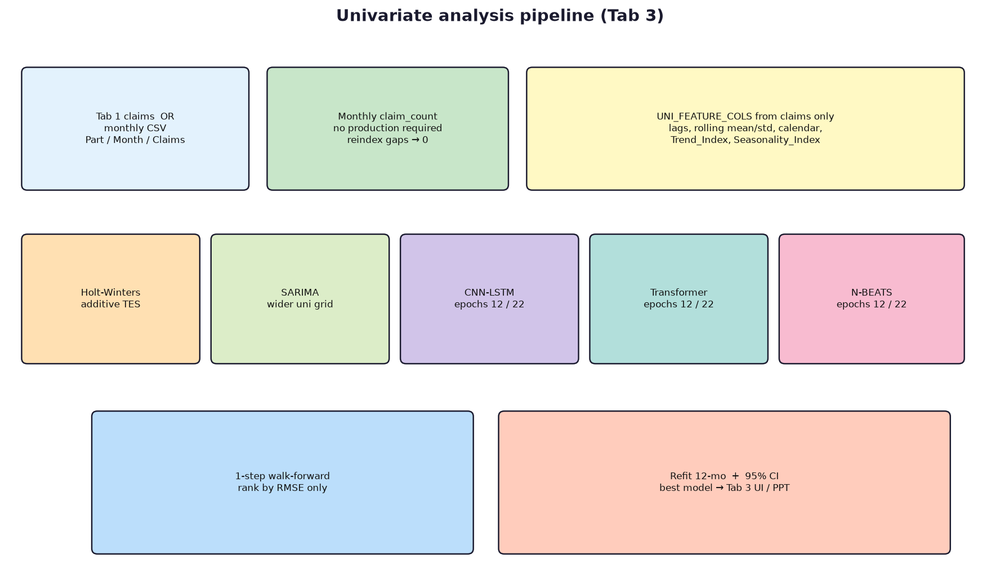
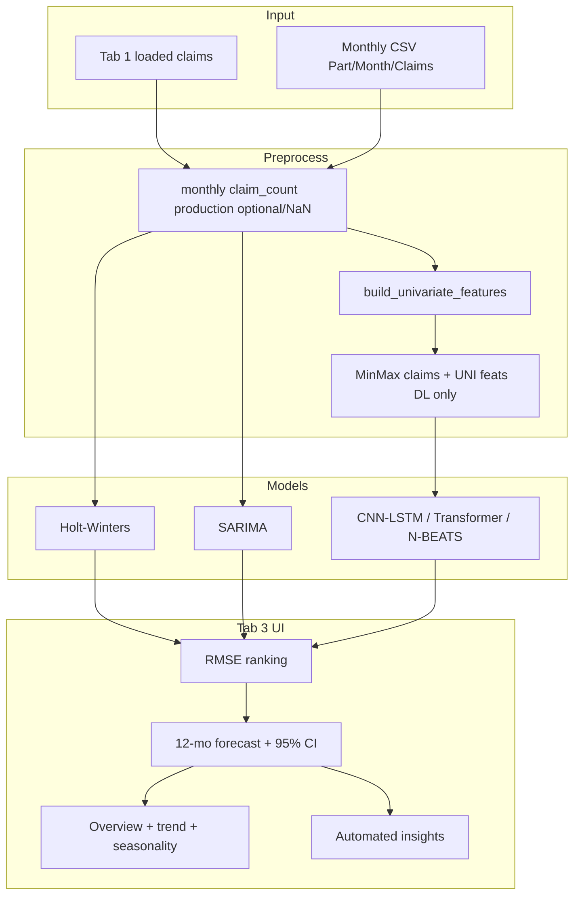
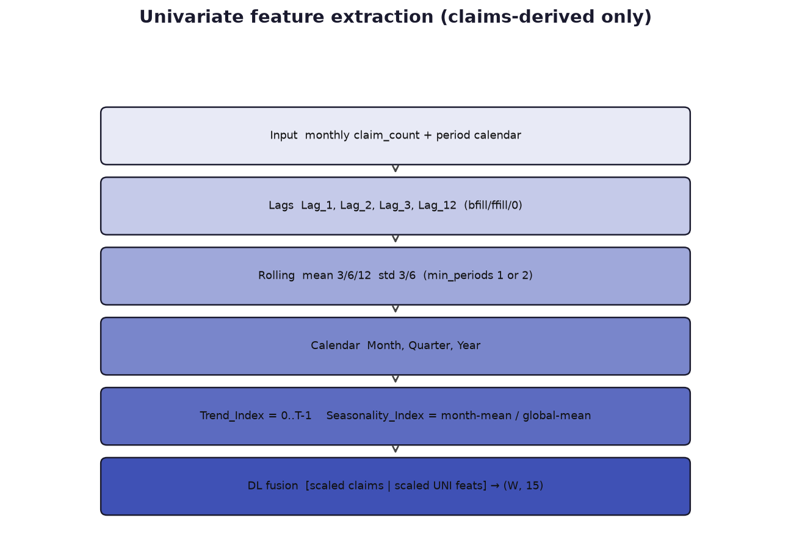
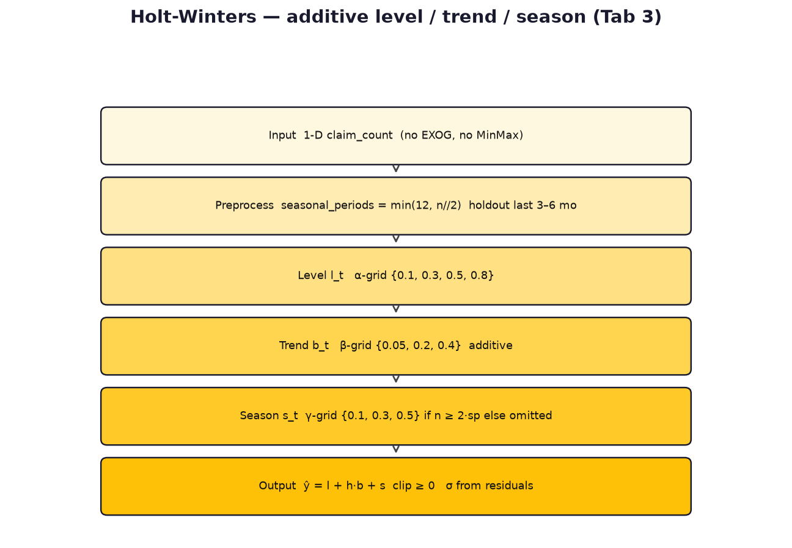
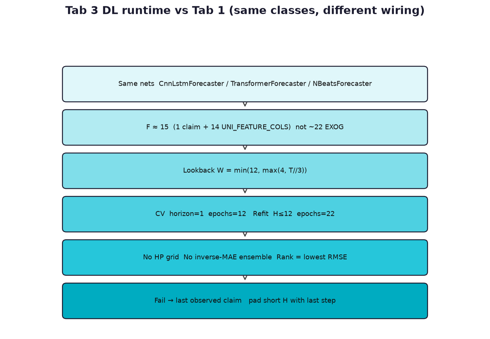

# Univariate Forecasting Models — Complete Architecture

Tab **3. Univariate Analysis** is a **claims-only** pipeline. It does **not** use production, odometer, FCO/K batch intensity, or other Tab 1 `EXOG_COLS`. It does **not** call `runner.py` training.

**Primary sources:** `forecasting/pipeline/univariate.py`, `forecasting/dashboard/univariate_views.py`, `forecasting/dashboard/app_ui.py` (Tab 3), plus the shared NumPy models in `forecasting/models/`.

Companion Word: [`UNIVARIATE_MODEL_ARCHITECTURE.docx`](UNIVARIATE_MODEL_ARCHITECTURE.docx)  
Multivariate (Tab 1) docs: [`MULTIVARIATE_MODEL_ARCHITECTURE.md`](MULTIVARIATE_MODEL_ARCHITECTURE.md)

---

## 1. Purpose and model roster

**Purpose:** Diagnose the claim series itself (trend, seasonality, quality), compare classical + deep models **without** manufacturing covariates, and produce a 12-month claims forecast with a 95% band.

| Model | Type | Role on Tab 3 | Code |
|---|---|---|---|
| **Holt-Winters** | Additive exponential smoothing | Unique to univariate tab; level + trend + optional season | `_holt_winters_forecast` |
| **SARIMA** | Seasonal ARIMA | Wider grid than Tab 1; claims series only | `_sarima_univariate` → `fit_sarima` |
| **CNN-LSTM** | Same NumPy net as Tab 1 | Claims + **UNI features** windows; **12 / 22 epochs** | `CnnLstmForecaster` |
| **Transformer** | Same NumPy net as Tab 1 | Same wiring as CNN-LSTM | `TransformerForecaster` |
| **N-BEATS** | Same NumPy net as Tab 1 | Same wiring as CNN-LSTM | `NBeatsForecaster` |

`UNI_MODELS = ["Holt-Winters", "SARIMA", "CNN-LSTM", "Transformer", "N-BEATS"]`

**Not on Tab 3:** inverse-MAE ensemble, Keras-CNN-LSTM, countermeasure multipliers, production/CPV.

**Selection rule:** one checked model → that model is the forecast; several → **lowest RMSE** on 1-step walk-forward wins (no composite RMSE/MAE/MAPE/R² weights).

---

## 2. Shared data flow (Tab 3)





### 2.1 Input layer

Two mutually compatible sources (CSV upload **does not** change Tab 1 multivariate state):

1. **Tab 1 claims** via `run_univariate_analysis` → `build_monthly_series(..., production=None, require_production=False)`.
2. **Template CSV/Excel:** `Part Name`, `Month` (`YYYY-MM`), `Claims` → `load_monthly_claims_csv` → `monthly_from_claims_sheet`.

Minimum usable series: **≥ 10 months** and **sum(claims) > 0**. Otherwise the run returns `None`.

### 2.2 Preprocessing (not neural)

- Reindex to a contiguous monthly calendar; missing months get **0 claims**.
- No MinMax for Holt-Winters / SARIMA (original claim units).
- Data-quality labels: `Good` / `Gaps filled` / `Short series` (&lt; 18 months) / `Flat / no variation` / `Empty`.

### 2.3 Feature extraction (claims-derived “embedding”)



```
UNI_FEATURE_COLS =
  Lag_1, Lag_2, Lag_3, Lag_12,
  Rolling_Mean_3, Rolling_Mean_6, Rolling_Mean_12,
  Rolling_Std_3, Rolling_Std_6,
  Month, Quarter, Year,
  Trend_Index, Seasonality_Index
```

| Feature | Construction |
|---|---|
| Lags | `shift(1,2,3,12)` then bfill / ffill / 0 |
| Rolling mean | windows 3, 6, 12; `min_periods=1` |
| Rolling std | windows 3, 6; `min_periods=2` |
| Calendar | month / quarter / year from `period` |
| `Trend_Index` | `0, 1, …, T-1` |
| `Seasonality_Index` | (mean of that calendar month) / (global mean + ε) |

**DL fusion** (same helper as Tab 1, different matrix):

```text
X[i] = concat( scaled_claims[i:i+W, None], scaled_UNI[i:i+W] )
# F = 1 + 14 = 15
y[i] = next H scaled claims
```

Lookback **W = min(12, max(4, T//3))** — often **shorter** than Tab 1’s CV-constrained W.

Holt-Winters and SARIMA **ignore** `UNI_FEATURE_COLS`; they see only `claim_count`.

### 2.4 Integration points

| Stage | Function |
|---|---|
| Walk-forward | `_walk_forward_1step` — up to 6 folds, train_end ≥ 8 |
| Classical refit | `_holt_winters_forecast`, `_sarima_univariate` on **full** series |
| DL refit | `_refit_dl_full` — parallel, **22 epochs**, horizon padded if short |
| Rank | RMSE ascending; `Best` star on row 0 |
| CI | `± 1.96 σ`, `σ = max(0.35·std(last 12), 0.5·HW residual σ, 1)` |
| UI | `univariate_views.py` figures/tables; PPT if Tab 3 has been run |
| Isolation | Does **not** write Tab 1 pickles / `best_params.json` |

---

## 3. Holt-Winters

**Purpose:** Fast, interpretable smoother for level, linear trend, and (when enough history) additive yearly season. Unique to Tab 3.



### 3.1 Layer-by-layer

There are no neural layers. The “architecture” is the **state-space of additive Holt-Winters** (`statsmodels.tsa.holtwinters.ExponentialSmoothing`).

| Stage | Role | Implementation |
|---|---|---|
| **Input** | 1-D claims `y_t` | Raw counts, clip forecasts ≥ 0 |
| **Preprocess** | Season length `sp = min(12, max(2, n//2))` | Seasonal **on** only if `n ≥ 2·sp` |
| **Holdout split** | Last `hold = max(3, min(6, n//4))` months | Grid search **not** on the test folds of DL |
| **Level** | Smoothing parameter **α** | Grid `{0.1, 0.3, 0.5, 0.8}` |
| **Trend** | Additive slope **β** | Grid `{0.05, 0.2, 0.4}`; `trend="add"` always |
| **Season** | Additive **γ** (or omitted) | Grid `{0.1, 0.3, 0.5}` if seasonal else none |
| **Init** | `initialization_method="estimated"` | `optimized=False` (fixed α,β,γ) |
| **Output** | `forecast(H)` + residual σ | Fail → repeat last value |

Additive recurrence (seasonal case, period `m`):

```text
l_t = α (y_t − s_{t−m}) + (1−α)(l_{t−1} + b_{t−1})
b_t = β (l_t − l_{t−1}) + (1−β) b_{t−1}
s_t = γ (y_t − l_{t−1} − b_{t−1}) + (1−γ) s_{t−m}
ŷ_{t+h} = l_t + h b_t + s_{t−m+((h−1) mod m)+1}
```

If history is too short for two full seasons, **season is dropped** (Holt’s linear trend only).

### 3.2 Additional features unique to Holt-Winters

- Grid is **RMSE on a terminal holdout**, then the winner is **refit on all y**.
- Residual σ (fitted − actual) feeds the **Tab 3 CI** formula.
- α / β / γ shown in the UI markdown (`holt_params`).
- No dropout, attention, residuals-of-blocks, or MinMax.

### 3.3 Pseudo-architecture

```text
sp = min(12, n//2)
seasonal = "add" if n >= 2*sp else None
best = argmin RMSE( forecast(holdout) ) over α × β × γ
fit ExponentialSmoothing(y, trend="add", seasonal=seasonal, sp)
return clip(forecast(H), 0), {α,β,γ}, std(fitted - y)
```

### 3.4 Tab 3 integration

Walk-forward uses **horizon 1** of this fitter. Accordion **3** prints best α,β,γ and holdout RMSE. Failure in a fold → **last train value**.

---

## 4. SARIMA (univariate grid)

**Purpose:** Seasonal ARIMA baseline on **unscaled** claims (unlike Tab 1, which scales then SARIMAX).

### 4.1 Layer-by-layer

Same statistical stack as Tab 1 (`SARIMAX` → AR/MA + seasonal AR/MA + differences) via `fit_sarima`:

| Stage | Tab 3 detail |
|---|---|
| **Input** | Raw `claim_count` |
| **Orders** | `(1,1,1)`, `(1,1,0)`, `(0,1,1)`, **`(2,1,1)`** |
| **Seasonal** | `(1,1,0,12)`, `(0,1,1,12)`, **`(1,0,1,12)`** |
| **Selection** | RMSE on a tail split (`split = max(8, n − hold)`) |
| **Output** | `fit_sarima` + clip ≥ 0; same MLE / seasonal-naive fallback |

### 4.2 Additional features vs Tab 1 SARIMA

- Extra AR order **(2,1,1)** and extra seasonal **(1,0,1,12)**.
- No fold-1-only MAE grid from `HP_GRIDS`; search is inside `_sarima_univariate`.
- Orders shown next to Holt-Winters in accordion 3.

### 4.3 Pseudo-architecture

```text
best = argmin RMSE(SARIMAX(y[:split]).forecast(tail))
return clip(SARIMAX(y, best).forecast(H), 0)
```

---

## 5. CNN-LSTM / Transformer / N-BEATS (Tab 3 wiring)

**Purpose:** Same layer stacks as Tab 1 (see multivariate doc), but **claims-derived features**, **fewer epochs**, and **RMSE-only** selection.



Neural **layer breakdown** is unchanged:

- CNN-LSTM: Conv1D 16 → Conv1D 8 → LSTM-32 → Dense(H); dropout; forget-bias 1.
- Transformer: embed + PE → MHA → FFN → MHA → mean pool → Dense(H).
- N-BEATS: flatten → 6 residual polynomial blocks.

### 5.1 What is different on Tab 3

| Item | Tab 1 multivariate | Tab 3 univariate |
|---|---|---|
| Feature channels | claim + ~21 EXOG | claim + **14 UNI_FEATURE_COLS** |
| CV epochs | 40 (CNN) / tuned N-BEATS & TF | **12** for all three |
| Refit epochs | 40 / tuned | **22** for all three |
| Lookback | `min(12, T−H−folds−2)` | `min(12, max(4, T//3))` |
| Rank | weighted RMSE/MAE/MAPE/R² | **RMSE only** |
| Ensemble | inverse-MAE | **none** (best model only) |
| HP grid | N-BEATS & Transformer | **none** (constructor defaults except epochs) |
| Fail | sometimes pred=actual | **last observed claim** |
| Short windows | skip part | DL → **naive last value** if `len(X) < 3` or `< 4` in CV |

### 5.2 Layer reminder (shared nets)

```text
# CNN-LSTM
c1 = Dropout(ReLU(Conv1D_k3(x, 16)))
c2 = Dropout(ReLU(Conv1D_k3(c1, 8)))
y  = Dense(H)(Dropout(LSTM_32(c2)[-1]))

# Transformer
e = x @ We + be + PE
e = e + Drop(MHA(e))
e = e + Drop(FFN(e))
e = e + Drop(MHA(e))
y = mean(e) @ Wd + bd

# N-BEATS
x, y = flatten(window), 0
for block in 6:
    bc, fc = block(x)      # 3×FC-64 + polynomial θ
    x, y = x - bc, y + fc
```

### 5.3 Additional features (Tab 3 only)

- Parallel `ThreadPoolExecutor` per fold and on full refit.
- If predicted horizon **H** &lt; 12, **repeat last step** to fill the table.
- Inverse MinMax with clip to `[0, 1]` then claims ≥ 0.

### 5.4 Integration

Checkbox **Models for univariate analysis**. Forecast plot draws **best** as a solid line and other selected models as dotted overlays (`make_uni_forecast_figure`).

---

## 6. Tab 3 UI — widget meaning

| Accordion / control | Output meaning |
|---|---|
| Download / load monthly CSV | Independent of Tab 1 production; template has Part_1 / Part_2 sample months |
| Part Name | Parts from Tab 1 **or** the monthly sheet |
| Run / Refresh | `force=True` retrains; part change may use cache |
| Model checkboxes | Empty → all five `UNI_MODELS` |
| **1. Data overview** | Rows, start/end month, missing count, quality status |
| **2. Claim trend** | History + rolling mean 3 & 12; bar seasonality Jan–Dec; markdown trend / growth / 6-mo change |
| **3. Model results** | Rank table RMSE/MAE/MAPE + ★; Holt αβγ; SARIMA orders; best name |
| **4. Forecast** | History + 95% CI band + best path + other models dotted; table Month / Forecast / CI / Best Model |
| **5. Insights** | Increasing/decreasing/stable; variation; 6-mo %; volatility; best RMSE line; quality note |

Tab **6** PPT adds univariate slides **only after** a successful Tab 3 run (`state["univariate"]`).

---

## 7. Edge-case testing notes

| Case | Expected | Where |
|---|---|---|
| No Tab 1 load and no CSV | Status: load claims or CSV | Tab 3 |
| &lt; 10 months or all-zero claims | `None` / empty render | Status |
| Missing months in CSV | Reindex; 0 fills; overview “Gaps filled” | Overview |
| Flat series | Quality “Flat / no variation”; R²/MAPE fragile | Insights |
| n too small for seasonal HW | `seasonal=None`; γ unused | Accordion 3 γ |
| HW / SARIMA exception | Last value (CV) or last-level forecast (refit) | Ranking |
| DL `len(X) < 4` in a fold | Last train value | OOS vs actual |
| DL `len(X) < 3` on refit | Naive last claim for that model | Forecast overlay |
| One model checked | Rank 1 that model; no RMSE bake-off | Rank table |
| Empty checkbox | Treated as **all five** models | `_resolve_uni_models` |
| SciPy missing | Skew/kurtosis from pandas | Stats (if shown via insights path) |
| Tab 3 vs Tab 1 winner | Often **different** (features + epochs + rank rule) | Do not mix |
| CSV then Tab 1 | Tab 1 unchanged | Tab 1 |

### 7.1 Checklist

1. Tab 1 claims loaded → Tab 3 Run with all five models → overview + two plots + 5-row rank + 12-row forecast.
2. Holt-Winters only → no DL wait; CI still draws.
3. Monthly CSV for a part **not** in Tab 1 → analysis still runs.
4. 12-month series → Short series label; HW may drop season.
5. All models fail DL windows → dotted/naive last-claim forecast, not a crash.
6. PPT: Tab 3 first, then Tab 6 includes univariate slides.

---

## 8. File map

| Path | Role |
|---|---|
| `forecasting/pipeline/univariate.py` | Features, HW, uni SARIMA, CV, DL refit, insights |
| `forecasting/dashboard/univariate_views.py` | Plotly + overview/forecast tables |
| `forecasting/dashboard/app_ui.py` | Tab 3 controls and cache `state["univariate"]` |
| `forecasting/models/cnn_lstm.py` etc. | Shared layer implementations |
| `forecasting/pipeline/runner.py` | `build_window_dataset` only |

```powershell
python scripts/generate_model_architecture_docs.py
```

Regenerates diagrams and both Word files (multivariate + univariate).
